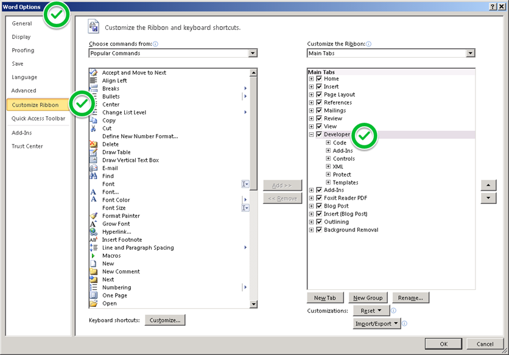
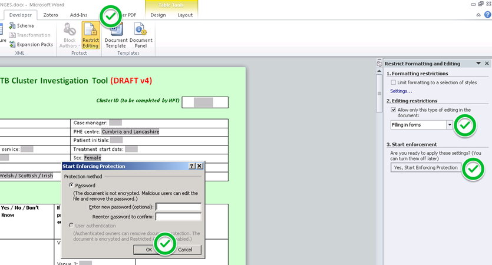

`deef` is a data extractor for electronic forms, compatible with Microsoft Word 
files with name ending `.docx`, i.e. compatible with Microsoft Office 2007 
and later.

It is a work in progress. Please log any issues in this project. For any other queries drop [me](mailto:paul.cleary@phe.gov.uk?Subject=deef) an email.

It allows you to load and extract form field data from a batch of `.docx` files 
which contain certain *legacy* electronic form fields:

- Text Form Fields 
- Check Box Form Fields
- Drop-Down Form Fields

See illustration for where to find these in the Word "ribbon". 

The questionnaire needs to be "protected" before use; otherwise the fields can be overwritten. You first need to make the Developer tab visible on the Ribbon as shown below, using Word Options:

Then you can protect the document thus: 

You don’t need to set a password (just leave the password fields blank and click Ok). 

Finally save the form. 

Limitation: Text Form Field data extracted may include other text in the same paragraph as the content control, so it is safest to use a table to structure your questionnaire and to put each content control in a separate cell, without any following text in the same cell. 

Data can be copied to the clipboard or downloaded from the app as CSV or Microsoft Excel files. 

The following packages must be installed:

- `data.table`
- `DT`
- `shiny`
- `XML`
- `xml2`

The app is also available to run as a demo at <https://deef.paulcleary.net> (hosted on my server but no sensitive data please).

You can also use the extraction function in your own code - see <https://gist.github.com/prcleary/c7f4dcbd9226c491ee53161ad7f88cef>.

