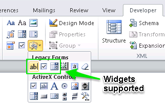

`deef` is a data extractor for electronic forms, compatible with Microsoft Word 
files with name ending `.docx`, i.e. compatible with Microsoft Office 2007 
and later.

It is a work in progress. Please log any issues in this GitLab project. For any other queries drop [me](mailto:paul.cleary@phe.gov.uk?Subject=deef) an email.

It allows you to load and extract form field data from a batch of `.docx` files 
which contain certain *legacy* electronic form fields:

- Text Form Fields 
- Check Box Form Fields
- Drop-Down Form Fields

See illustration for where to find these in the Word "ribbon". 



Limitation: Text Form Field data extracted may include other text in the same paragraph as the content control so it is safest to use a table to structure your questionnaire and to put each content control in a separate cell. 

Data can be copied to the clipboard or downloaded from the app as CSV or Microsoft Excel files. 

You can run the app direct from GitLab with the code below.
The following packages must be installed:

- `data.table`
- `DT`
- `shiny`
- `XML`
- `xml2`

```
library(shiny)
runUrl('https://gitlab.phe.gov.uk/Paul.Cleary/deef/repository/archive.zip')
```

The app is also avaiable to run from the PHE test Shiny Server [here](http://158.119.199.25:3838/paul/deef/).

Future functionality will include the ability to extract data from merge fields as well.
